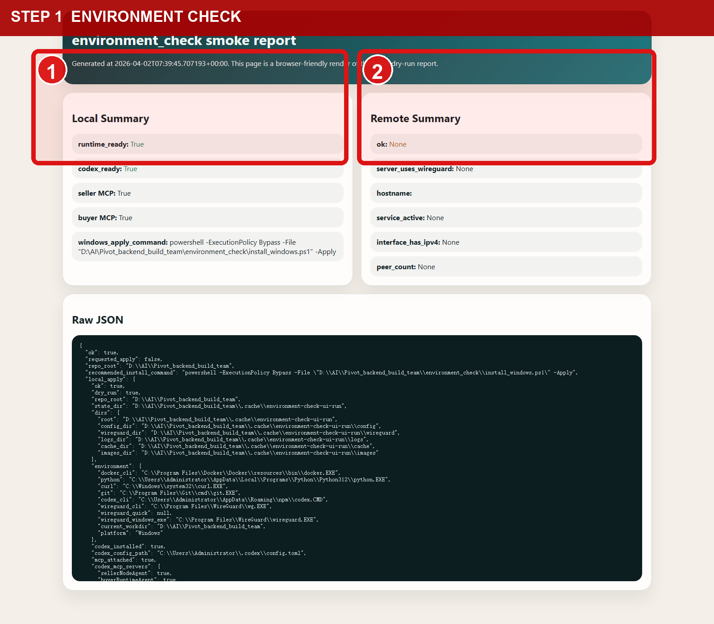
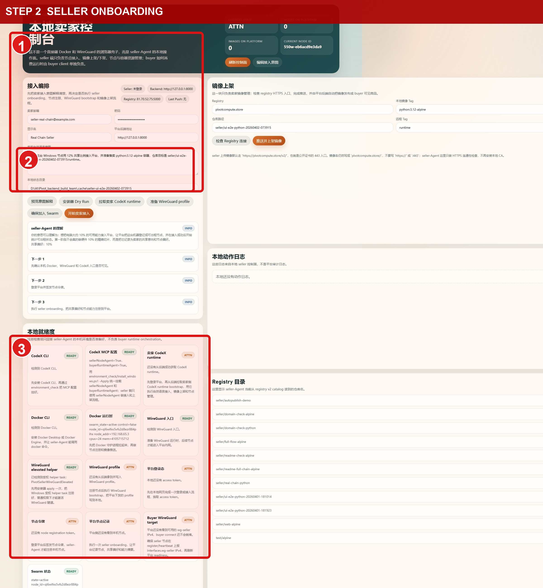
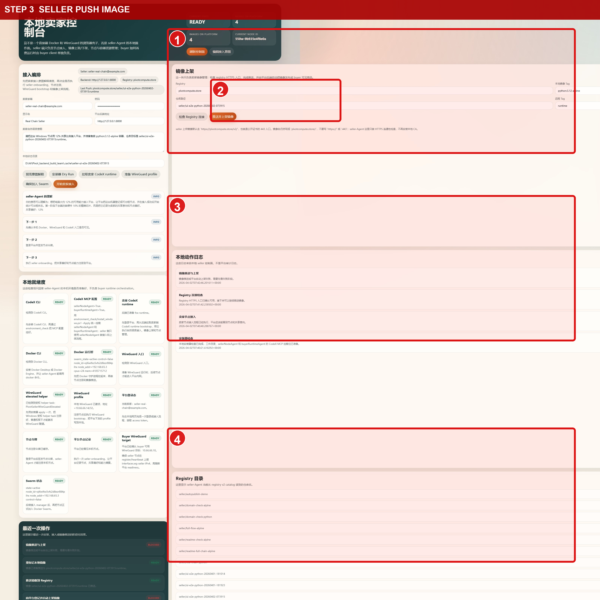
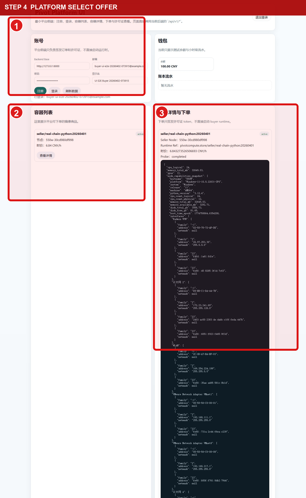
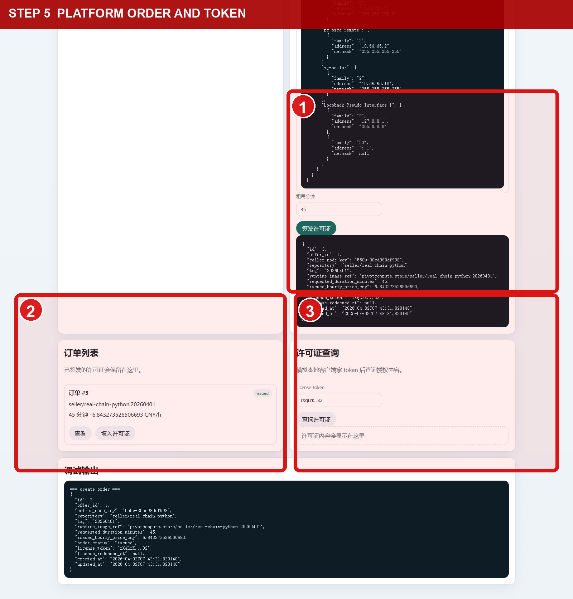
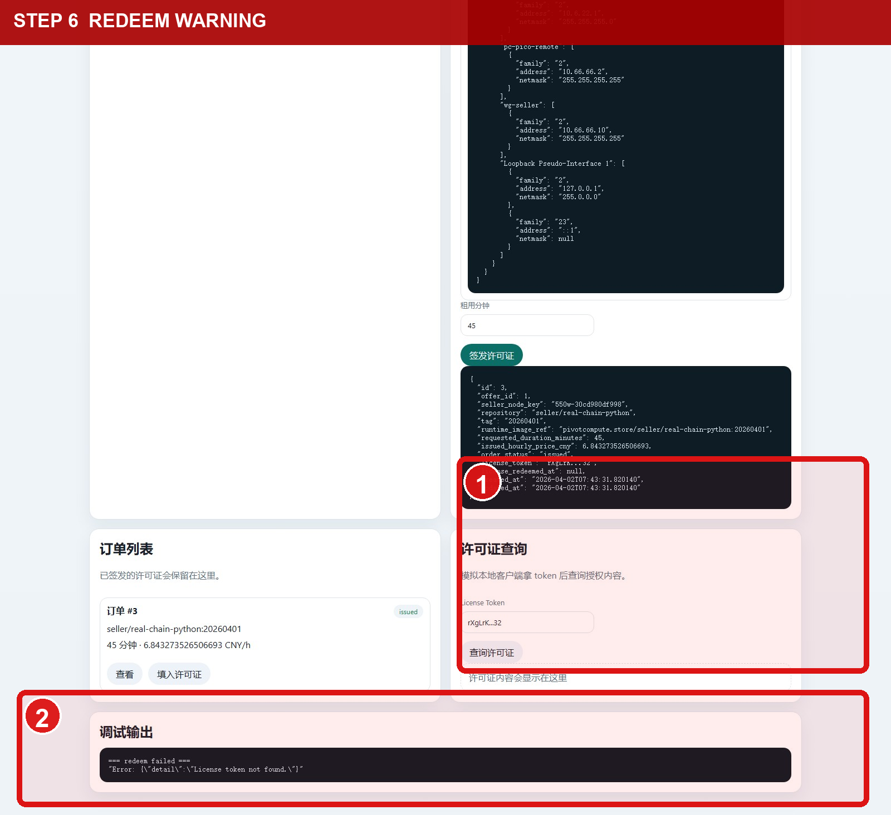
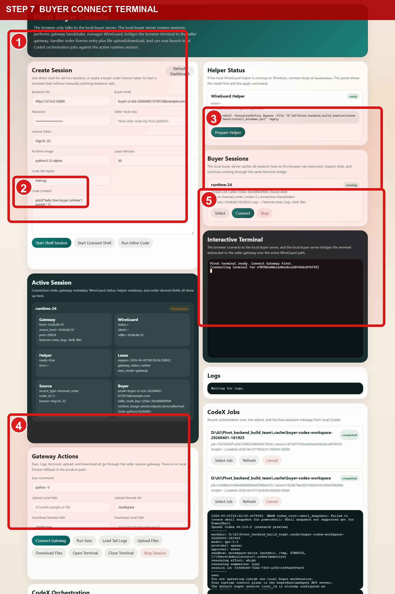

# Seller To Buyer UI 新手操作引导 2026-04-02

这份文档是按你给的顺序，基于 `2026-04-02` 这次真实跑出来的结果整理的新手引导。

- 运行时间：`2026-04-02 15:39` 到 `2026-04-02 16:04`（Asia/Shanghai）
- 证据目录：`docs/assets/ui-full-closed-loop-20260402-073915`
- 红框引导图目录：`docs/assets/ui-full-closed-loop-20260402-073915/newbie-guide`

## 先说结论

- `environment_check`：通过
- 卖家页接入：通过
- 卖家页推镜像到 Registry：通过
- 卖家镜像自动变成买家可见 active offer：这次没有通过
- 平台页下单拿 `license_token`：通过
- 平台页“Redeem license”按钮：这次返回 `License token not found.`
- 买家页建立会话、连上网关、打开终端：通过
- 买家页 CodeX 编排：这次没有作为闭环成功项保留，卡在本机权限激活 `wg-buyer`
- 清理：已手动停止 `session_id=24`，远端 `runtime-24` / `gateway-24` 已确认移除

所以，这次真实产品状态是：

1. 卖家接入和镜像推送已经能从 UI 跑通。
2. 买家消费也已经能从 UI 跑通。
3. 严格意义上“卖家刚上架的那一份镜像，立刻被买家买到”这条链路还差一步。
4. 这次为了把 buyer 半段跑通，平台页选择了已经处于 `active` 的回退镜像 `seller/real-chain-python:20260401`。

## 0. 启动顺序

按下面顺序做就行：

1. 运行 `environment_check`
2. 补齐本机运行环境
3. 打开卖家客户端、平台后端
4. 在卖家界面操作
5. 在买家界面操作

## 1. 运行 environment_check

管理员 PowerShell 执行：

```powershell
powershell -ExecutionPolicy Bypass -File "environment_check\install_windows.ps1" -Apply
```

看图里的红框：

- `1`：本机至少要看到 `runtime_ready=True`、`codex_ready=True`
- `2`：远端 WireGuard / Swarm 也要能通过



如果这里没过，就不要继续点卖家页和买家页。

## 2. 运行其他环境配置

这一步我实际做了三件事：

1. 确认 Docker Desktop 已经启动，`docker version` 能返回服务端信息
2. 确认平台后端在 `http://127.0.0.1:8000` 可访问
3. 启动两个本地页面

如果你本地还没起服务，可以这样开：

```powershell
cd backend
uvicorn app.main:app --host 127.0.0.1 --port 8000
```

另开两个窗口：

```powershell
python seller_client\agent_server.py
```

```powershell
python buyer_client\agent_server.py
```

打开地址：

- 卖家页：`http://127.0.0.1:3847`
- 平台页：`http://127.0.0.1:8000/platform-ui`
- 买家页：`http://127.0.0.1:3857`

## 3. 卖家界面操作

### 3.1 先完成卖家接入

看图：

- `1`：先填卖家邮箱、密码、`Backend URL`、`state_dir`、镜像相关信息
- `2`：按钮顺序按 `预览意图 -> 预演 Dry Run -> 继续接入`
- `3`：下面 readiness 卡片尽量大部分是 `READY`



这次实际结果：

- 卖家接入成功
- 本机 `wg-seller`、helper、bridge 都已就绪

### 3.2 推送卖家镜像

看图：

- `1`：确认右侧 `repository` / `tag`
- `2`：先点 `信任 Registry 连接`，再点 `推送并上架`
- `3`：看本地动作日志
- `4`：看 Registry 目录里有没有新镜像



这次真实结果：

- Docker push 成功
- 新镜像仓库是 `seller/ui-e2e-python-20260402-073915:runtime`
- 但平台自动发布没有把它变成 buyer 可见的 `active offer`

也就是说，卖家半段到 Registry 是通的，`push -> active offer` 这一跳还没完全修好。

## 4. 平台页操作

### 4.1 登录买家账号并选商品

看图：

- `1`：先注册或登录买家账号
- `2`：在目录里选一个 `active offer`
- `3`：右侧确认镜像信息



这次实际选中的不是刚刚 seller 新推的镜像，而是回退到：

```text
seller/real-chain-python:20260401
```

原因是新推镜像还没进入 `active`。

### 4.2 下单并拿到 license token

看图：

- `1`：填租用分钟数，然后点 `签发许可证`
- `2`：订单号会出现在左下
- `3`：`license token` 要记下来，下一页 buyer 要粘贴



这次实际结果：

- `order_id=3`
- 下单成功
- `license_token` 已成功签发

### 4.3 关于 Redeem license 这个坑

看图：

- `1`：右侧“许可证查询”这次没有拿到内容
- `2`：底部明确返回了 `License token not found.`



这次的建议操作不是卡在这里，而是：

1. 直接使用上一步“签发许可证”返回的 `license_token`
2. 去买家页粘贴这个 token
3. 继续建立会话

## 5. 买家界面操作

看图：

- `1`：先填 `backend`、买家账号、`license token`
- `2`：点 `Start Shell Session`
- `3`：会话出来后，在 `Buyer Sessions` 里点 `Connect`
- `4`：连上后到 `Gateway Actions` 点 `Open Terminal`
- `5`：在终端里执行 `python -V` 做连通性验证



这次真实结果：

- 会话创建成功
- 网关连接成功
- 浏览器终端成功打开
- 在容器终端里能执行命令

## 6. 这次实际跑通到哪

这次我实际确认到的闭环是：

1. `environment_check` 通过
2. 卖家页接入通过
3. 卖家页推镜像到 Registry 通过
4. 平台页登录、选 active offer、下单、拿 token 通过
5. 买家页用 token 建会话、连网关、开终端通过
6. 远端会话停止后，`runtime-24` / `gateway-24` 已经清理掉

还没有完全打通的地方：

1. 卖家刚推的新镜像没有自动进入 buyer catalog 的 `active`
2. 平台页的 `Redeem license` 这次返回 `License token not found.`
3. 买家页 CodeX 面板这次卡在本机 `wg-buyer` 权限激活，不把它计入本次“闭环已通过”结论

## 7. 给新手的最短版操作单

如果你只想照着点一遍，最短路径就是：

1. 跑 `environment_check\install_windows.ps1 -Apply`
2. 确认 Docker Desktop、后端、卖家页、买家页都起来
3. 卖家页填信息，按 `预览意图 -> 预演 Dry Run -> 继续接入`
4. 卖家页点 `信任 Registry 连接 -> 推送并上架`
5. 平台页登录买家账号，选一个 `active offer`
6. 平台页填分钟数，点 `签发许可证`
7. 不要卡在 `Redeem license`，直接复制上一步 token
8. 买家页粘贴 token，点 `Start Shell Session -> Connect -> Open Terminal`
9. 终端执行 `python -V`

如果 `python -V` 能在 buyer 终端里返回版本号，这条卖家到买家的 UI 主链路就算通了。
